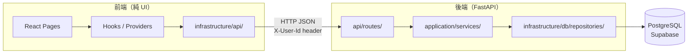

# BlindBox 全端三層架構

## 1. 架構說明

BlindBox 採用**全端三層架構**，前端為純 UI，後端承載業務邏輯與資料存取，兩者以 HTTP JSON API 溝通。

| 層級 | 英文名稱 | 職責摘要 |
|------|----------|----------|
| **表現層** | Presentation Layer | 畫面、互動、路由、表單與畫面狀態 |
| **應用邏輯層** | Application Logic Layer | 功能流程、驗證、商業規則、Service |
| **資料層** | Data Layer | SQL 查詢、資料讀寫與持久化（PostgreSQL） |

---

## 2. 系統架構圖



---

## 3. 各層職責

### 3.1 表現層（前端）

- **React** 頁面與元件，只負責呈現資料與接收使用者操作。
- 透過 `useAppState()`、`useCatalogProducts()` 等 hooks 取得資料。
- 不直接連資料庫；所有資料來自後端 API。

| 路徑 | 說明 |
|------|------|
| `frontend/presentation/pages/` | 功能頁面 |
| `frontend/presentation/components/` | 共用 UI 元件 |
| `frontend/presentation/hooks/` | `useCatalog`、`useAppState` 等 |
| `frontend/presentation/providers/` | `AppStateProvider`（useEffect + fetch） |
| `frontend/presentation/router/` | 路由定義 |
| `backend/src/api/routes/` | HTTP 路由、請求/回應格式 |

### 3.2 應用邏輯層（後端）

- 業務規則與功能流程，呼叫 Repository 取得資料後組合回傳。

| 路徑 | 說明 |
|------|------|
| `frontend/domain/entities/` | TypeScript 型別（鏡像後端 Pydantic） |
| `frontend/infrastructure/api/` | 薄 HTTP client（apiFetch + 各模組） |
| `backend/src/application/` | Python Service（catalog、listing、cart…） |
| `backend/src/domain/entities.py` | Pydantic 模型 |

### 3.3 資料層（後端）

- SQL 查詢直接對應 PostgreSQL 表格，以 psycopg2 執行。

| 路徑 | 說明 |
|------|------|
| `backend/src/infrastructure/db/repositories/` | 各表的查詢與寫入 |
| `backend/src/infrastructure/db/config.py` | `get_database_url()` |
| `backend/alembic/` | Schema migration 版本管理 |
| `frontend/data/` | 圖鑑 JSON 種子來源（由 `npm run db:seed` 匯入） |

---

## 4. 依賴規則

```
表現層  →  應用邏輯層  →  資料層
```

| 規則 | 說明 |
|------|------|
| 前端只呼叫後端 API | 不直接操作 DB 或 localStorage |
| 後端 Service → Repository | Service 不直接寫 SQL |
| Repository → DB | 只做資料讀寫，不含業務規則 |
| 前端 hooks → API client | 頁面不直接呼叫 `apiFetch` |

---

## 5. 資料流範例

### 瀏覽圖鑑商品

```
使用者點選圖鑑頁
  → Explore 頁面呼叫 useCatalogProducts()
  → getCatalogProducts() 送出 GET /api/catalog/products
  → FastAPI catalog.py route
  → catalog_service.list_products()
  → catalog_repository.get_all_products() 查詢 catalog_products 表
  → 回傳 JSON → 前端渲染商品格
```

### 新增上架貼文

```
使用者填寫 AddListing 表單送出
  → useAppState().createListing(input)
  → listingsApi.createListing() 送出 POST /api/listings
  → listings.py route（帶 X-User-Id header）
  → listing_service.new_listing()
  → listing_repository.create_listing() INSERT INTO listings
  → 回傳新貼文 → 導向 /listing/:id
```

---

## 6. 目錄與三層對照總表

```
【表現層】
  frontend/presentation/          ← React 頁面、元件、hooks、providers
  backend/src/api/routes/         ← HTTP 端點

【應用邏輯層】
  frontend/domain/entities/       ← TypeScript 型別
  frontend/infrastructure/api/    ← HTTP client（薄層）
  backend/src/application/        ← Python Service
  backend/src/domain/entities.py  ← Pydantic 模型

【資料層】
  backend/src/infrastructure/db/  ← Repository（SQL）、DB 連線
  backend/alembic/                ← Schema migration
  frontend/data/                  ← 圖鑑 JSON（種子來源）

【共用】
  frontend/shared/                ← cn() 等工具
```

---

## 7. 認證設計

目前：每個 API 請求帶 `X-User-Id` header（值為 `VITE_DEV_USER_ID`）。  
後端 `get_current_user_id()` 讀取此 header，未來替換為 JWT 時只需修改此函式。

---

## 8. 未來擴充方向

| 項目 | 說明 |
|------|------|
| JWT 認證 | 替換 `X-User-Id` header，接 Supabase Auth |
| 圖片上傳 | 改走 Supabase Storage，存 URL |
| 聊天 / 通知 | 新增 chat、notification 後端模組 |
| 購買 / 出售記錄 | 接 orders 表 |
| React Query | 前端加入 loading/error 狀態管理 |
