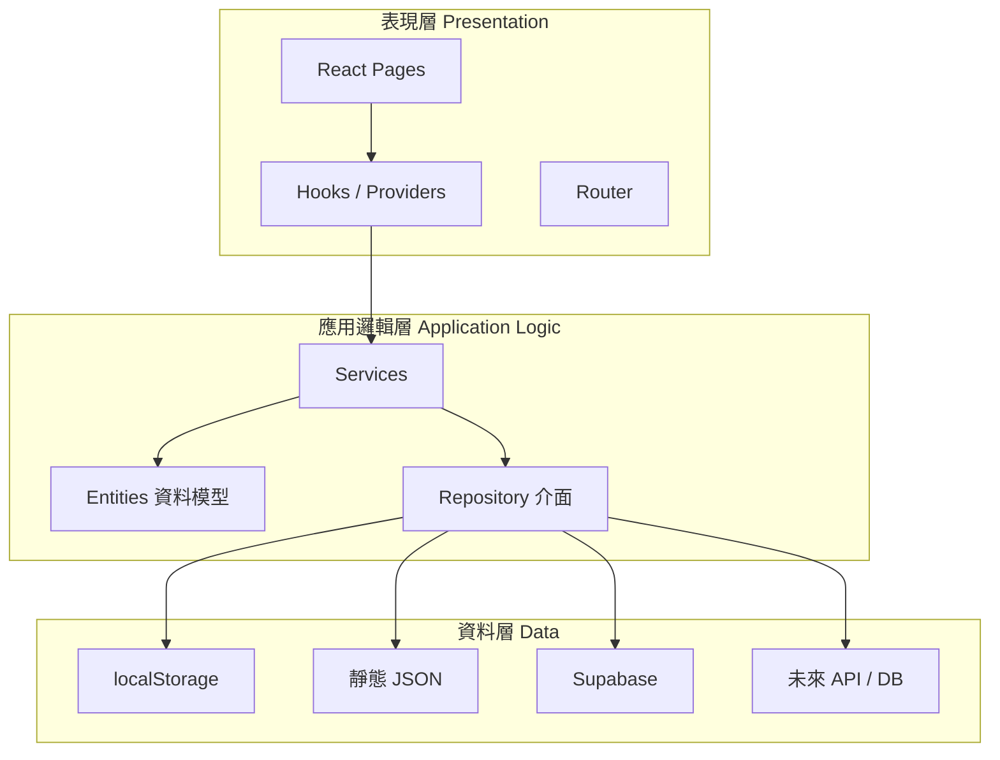

# BlindBox 全端三層架構

## 1. 架構說明

BlindBox 採用**全端三層架構**，適合系統分析與設計文件描述整體系統，而非將「前端內部」與「後端內部」各畫一套三層。

三層分工如下：

| 層級 | 英文名稱 | 職責摘要 |
|------|----------|----------|
| **表現層** | Presentation Layer | 畫面、互動、路由、表單與畫面狀態 |
| **應用邏輯層** | Application Logic Layer | 功能流程、驗證、狀態協調、商業規則、Service |
| **資料層** | Data Layer | 資料讀寫與持久化（Repository、JSON、localStorage、Supabase） |

**目前實作狀態**：以 React 前端為主完成表現層與應用邏輯層；資料層已具 local / 靜態 JSON 實作，Supabase 連線可用，部分 Repository 仍為預留。未來後端的 API 路由屬表現層、Controller/Service 屬應用邏輯層、資料庫存取屬資料層，與前端共用同一套分層概念。

---

## 2. 各層職責

### 2.1 表現層（Presentation Layer）

- 主要由 **React** 介面組成。
- 負責：頁面呈現、使用者操作、表單輸入、畫面狀態顯示、路由切換。
- **不應**直接讀寫 localStorage、Supabase 或靜態 JSON 檔；應透過 hooks / providers 呼叫應用邏輯層。

**對應目錄（目前）**

| 路徑 | 說明 |
|------|------|
| `frontend/presentation/pages/` | 各功能頁面 |
| `frontend/presentation/components/` | 共用 UI 元件 |
| `frontend/presentation/hooks/` | 連接 Service 的 React hooks |
| `frontend/presentation/providers/` | Context（如 `AppStateProvider`） |
| `frontend/presentation/router/` | 路由定義 |
| `frontend/App.tsx`、`frontend/main.tsx` | 應用程式進入點 |

**未來後端（預留）**：`backend/src/api/` — HTTP 路由、請求/回應格式、中介層。

---

### 2.2 應用邏輯層（Application Logic Layer）

- 負責系統**主要功能流程**與**商業規則**。
- 包含：資料驗證、功能編排、前端狀態與 Service 的協調、對資料層的呼叫。
- 未來後端的 Controller / Service 邏輯也歸屬此層。

**對應目錄（目前）**

| 路徑 | 在整體架構中的角色 |
|------|-------------------|
| `frontend/application/services/` | **Service**：圖鑑、貼文、購物車、個人資料、市集首頁等用例 |
| `frontend/domain/entities/` | **資料模型**（Listing、商品、使用者設定等型別） |
| `frontend/domain/repositories/` | **Repository 介面**（定義「要存什麼」，不含實際存取） |
| `frontend/presentation/providers/` 內的狀態編排 | 將 Service 結果同步到 React 畫面（屬表現層，但只呼叫 Service） |

> **說明**：`domain` 是程式碼組織用的子資料夾（型別與介面），在系統架構圖上**不另畫第四層**，一律歸入**應用邏輯層**。

**主要 Service**

| Service | 功能 |
|---------|------|
| `CatalogService` | 圖鑑、搜尋、品牌標籤 |
| `ListingService` | 市集貼文、種子貼文合併 |
| `CartService` | 購物車 |
| `ProfileService` | 頭像與個人資料 |
| `MarketplaceService` | 首頁排行榜、推薦等組合邏輯 |

**未來後端（預留）**：`backend/src/application/` — 與前端對齊的業務流程（可共用或複製 Service 規則）。

---

### 2.3 資料層（Data Layer）

- 負責**資料存取與持久化**。
- 包含：Repository 實作、localStorage、靜態 JSON、Supabase Client、未來資料庫或 REST API 存取。
- 透過 `.env` 的 `VITE_DATA_SOURCE` 切換資料來源（不影響表現層程式）。

**對應目錄（目前）**

| 路徑 | 說明 |
|------|------|
| `frontend/infrastructure/persistence/local/` | localStorage（貼文、購物車、個人資料） |
| `frontend/infrastructure/persistence/static/` | 靜態 JSON 圖鑑（`popmart-hk-showcase.json`） |
| `frontend/infrastructure/persistence/supabase/` | Supabase Client 與 Repository（部分為預留 stub） |
| `frontend/infrastructure/di/` | 組裝 Service 與 Repository（`getAppContainer()`） |
| `frontend/infrastructure/config/` | 環境設定（資料來源模式等） |
| `frontend/data/` | 圖鑑 JSON 檔案本體 |
| `backend/alembic/` | **Alembic** migration 版本（PostgreSQL schema） |
| `backend/migrations/sql/` | 參考用 SQL（初始 schema） |
| `backend/src/infrastructure/db/` | 資料庫連線、ORM Base |

**資料來源切換**（`VITE_DATA_SOURCE`）

| 值 | 行為 |
|----|------|
| `local`（預設） | 靜態 JSON 圖鑑 + 瀏覽器 localStorage |
| `supabase` | 改用 Supabase Repository（實作完成後生效；連線已可驗證） |
| `api` | 預留：透過 HTTP 呼叫 `backend/` API |

**未來後端（預留）**：`backend/src/infrastructure/` — 資料庫、ORM、對 Supabase 的伺服器端存取。

---

## 3. 依賴規則

依賴方向固定為：

```
表現層  →  應用邏輯層  →  資料層
```

| 規則 | 說明 |
|------|------|
| 表現層 → 應用邏輯層 | 頁面與 hooks 可呼叫 Service、使用 Context，**不**直接操作儲存細節 |
| 應用邏輯層 → 資料層 | Service 透過 Repository **介面**（`frontend/domain/repositories/`）呼叫實作 |
| 資料層 | 不依賴 React；只負責讀寫資料 |
| 共用工具 | `frontend/shared/`（如 `cn()`）可被各層使用，但不包含業務邏輯 |

**實務 import 建議**

- 頁面：`useAppState()`、`useCatalog()`、`useAppServices()` ✅  
- 頁面：`import ... from '@/frontend/infrastructure/...'` ❌（避免 UI 綁死資料來源）  
- Service：依賴 `ICatalogRepository` 等介面 ✅  
- Repository 實作：在 `infrastructure/persistence/` ✅  

---

## 4. 資料流範例

### 4.1 一般流程

```
使用者在 React 介面操作
  → 表現層接收輸入並觸發事件（按鈕、表單、路由）
  → 應用邏輯層執行驗證、狀態更新與商業邏輯（Service）
  → 資料層透過 Repository 存取 localStorage / 靜態 JSON / Supabase
  → 結果回傳應用邏輯層 → 表現層更新畫面
```

### 4.2 新增市集貼文

```
使用者在「新增上架」頁填寫表單並送出
  → 表現層：AddListing 頁面呼叫 useAppState().createListing()
  → 應用邏輯層：ListingService.createListing() 建立貼文物件
  → 資料層：LocalListingRepository 寫入 localStorage
  → 表現層：AppStateProvider 重新整理列表，導向貼文詳情頁
```

### 4.3 瀏覽圖鑑商品

```
使用者點選首頁排行榜商品
  → 表現層：導向 /product/:id
  → 應用邏輯層：CatalogService.getProductById()
  → 資料層：StaticCatalogRepository 從 JSON 讀取
  → 表現層：ProductDetail 顯示標題、價格、圖片
```

---

## 5. 目錄與三層對照總表

```
【表現層 · 前端 frontend/】
  frontend/presentation/
  frontend/App.tsx, frontend/main.tsx, frontend/index.css

【應用邏輯層 · 前端 frontend/】
  frontend/application/services/
  frontend/domain/entities/          ← 資料模型（子資料夾）
  frontend/domain/repositories/      ← 存取介面（子資料夾）

【資料層 · 前端 frontend/】
  frontend/infrastructure/
  frontend/data/

【共用】
  frontend/shared/

【後端預留 · backend/ · 同樣三層概念】
  backend/src/api/               ← 表現層
  backend/src/application/       ← 應用邏輯層
  backend/src/infrastructure/    ← 資料層
```

程式碼仍保留 `presentation`、`application`、`domain`、`infrastructure` 等資料夾名稱，以便開發時快速定位；**對外文件與系統設計圖請統一使用「表現層／應用邏輯層／資料層」三層描述**。

---

## 6. 組裝與擴充

- **組裝入口**：`getAppContainer()`（`frontend/infrastructure/di/getAppContainer.ts`）將 Service 與 Repository 接好，由 `AppServicesProvider` 注入 React。
- **Supabase（前端）**：`.env` 的 `VITE_SUPABASE_URL`、`VITE_SUPABASE_ANON_KEY`；驗證 `npm run check:supabase`。
- **資料庫版本管理（Alembic）**：在 `backend/` 以 Alembic 管理 PostgreSQL schema，屬**資料層**。
  - 設定：`DATABASE_URL`（Supabase Database 連線字串，見 `.env.example`）
  - 初始 migration：`0001_initial_schema`（listings、users、orders、chats 等）
  - 指令：`npm run db:migrate`、`npm run db:current`（詳見 [`backend/README.md`](../backend/README.md)）
- **擴充建議**（由近到遠）  
  1. 執行 `alembic upgrade head` 建立 Supabase 表結構  
  2. 完成 Supabase Repository 實作，切換 `VITE_DATA_SOURCE=supabase`  
  3. 實作 `backend/src/api` REST，前端改為 `api` 模式  
  4. 登入、權限、聊天等接 Supabase Auth / Realtime  

---

## 7. 專案根目錄與舊路徑相容

| 目錄 | 說明 |
|------|------|
| `frontend/` | 前端 React 專案（原 `src/`） |
| `backend/` | 後端 API 預留（原 `server/`） |

**Import alias**（`tsconfig.json` / `vite.config.ts`）：

| 路徑 | 說明 |
|------|------|
| `@/frontend/*` | **建議使用**，指向 `frontend/` |
| `@/src/*` | **相容舊碼**，與 `@/frontend/*` 等價（deprecated） |
| `@/domain/*` 等 | 指向 `frontend/domain/*` 等子層 |

| 舊 import | 建議改用 |
|-----------|----------|
| `@/src/context/AppState` 或 `@/frontend/context/AppState` | `@/frontend/presentation/providers/AppStateProvider` |
| `@/src/lib/popmartShowcase` | `useCatalog()` 或 `CatalogService` |
| `@/src/lib/supabase` | `getSupabaseClient()`（`frontend/infrastructure/persistence/supabase/`） |

新功能請使用 `@/frontend/...`，並遵守三層依賴規則。

---

## 8. 架構示意圖


